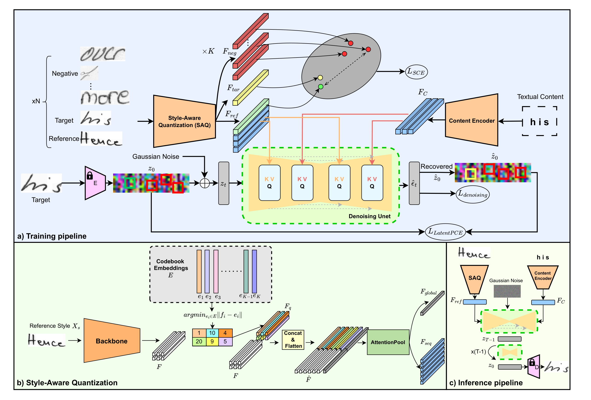
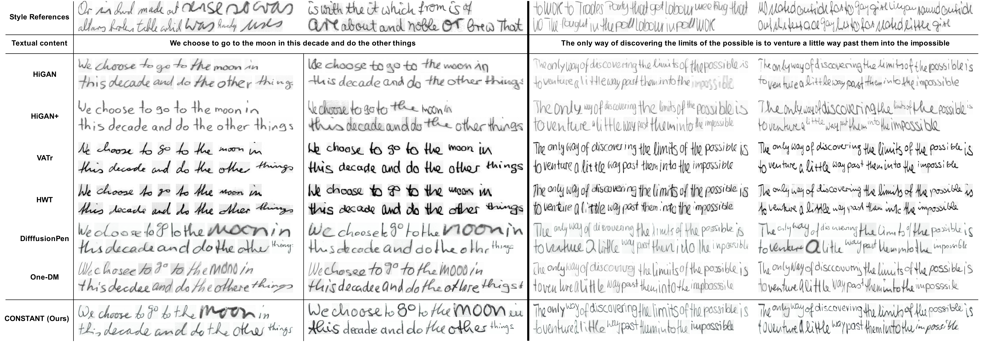
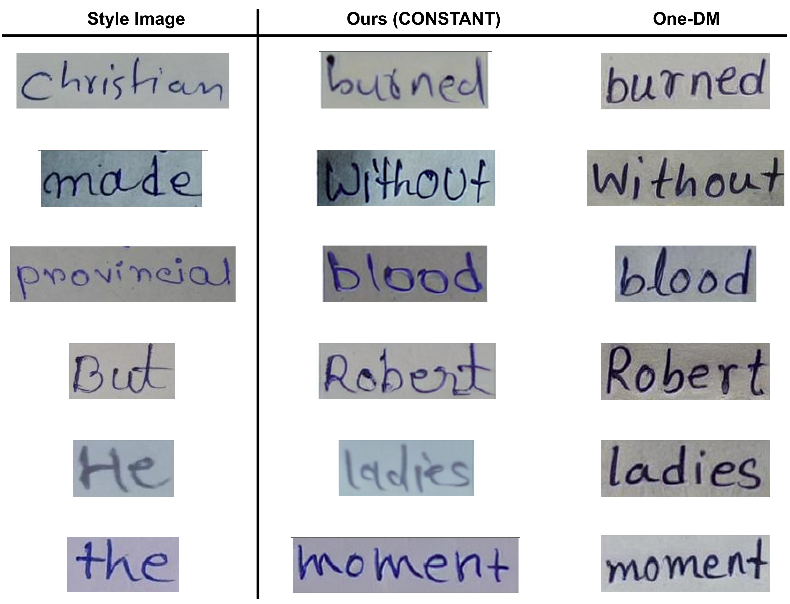

---

<p align="center">
  <h1 align="center">🖋️ CONSTANT: Towards High-Quality One-Shot Handwriting Generation with Patch Contrastive Enhancement and Style-Aware Quantization</h1>
  <h1  align="center">WACV 2026-Oral (Award Finalist)</h1>
  <p align="center">
    <a href="https://arxiv.org/abs/2603.07543"></a>
    <a href="https://openaccess.thecvf.com/content/WACV2026/html/Le_CONSTANT_Towards_High-Quality_One-Shot_Handwriting_Generation_with_Patch_Contrastive_Enhancement_WACV_2026_paper.html"></a>
    <a href="https://www.youtube.com/watch?v=UZCcP25-KLk&t=47s"></a>
    <a href="https://drive.google.com/drive/folders/1xpMceSRqbcRKcson7LIrISdPbC1srPDo?usp=drive_link"></a>
  </p>
</p>

---

This repository contains the official implementation of the paper:

> **"CONSTANT: Towards High-Quality One-Shot Handwriting Generation with Patch Contrastive Enhancement and Style-Aware Quantization"**
> *Authors: Anh-Duy Le, Van-Linh Pham, Thanh-Nam Vo, Xuan Toan Mai, Tuan-Anh Tran*
> Published at IEEE/CVF Winter Conference on Applications of Computer Vision (WACV), 2026

## Overview

One-shot styled handwriting image generation, despite achieving impressive results in recent years, remains challenging due to the difficulty in capturing the intricate and diverse characteristics of human handwriting by using solely a single reference image. Existing methods still struggle to generate visually appealing and realistic handwritten images and adapt to complex, unseen writer styles, struggling to isolate invariant style features (e.g., slant, stroke width, curvature) while ignoring irrelevant noise. To tackle this problem, we introduce Patch Contrastive Enhancement and Style-Aware Quantization via Denoising Diffusion (CONSTANT), a novel one-shot handwriting generation via diffusion model. CONSTANT leverages three key innovations: 1) a Style-Aware Quantization (SAQ) module that models style as discrete visual tokens capturing distinct concepts; 2) a contrastive objective to ensure these tokens are well-separated and meaningful in the embedding style space; 3) a latent patch-based contrastive (LLatentPCE) objective help improving quality and local structures by aligning multiscale spatial patches of generated and real features in latent space. Extensive experiments and analysis on benchmark datasets from multiple languages, including English, Chinese, and our proposed ViHTGen dataset for Vietnamese, demonstrate the superiority of adapting to new reference styles and producing highly detailed images of our method over state-of-the-art approaches.

## Table of Contents

- [Resources Download](#resources-download)
- [Quick Start](#quick-start)
- [Development Environment Setup](#development-environment-setup)
- [Documentation](#documentation)
- [Repository Structure](#repository-structure)
- [Main Results](#main-results)
- [Citation](#citation)
- [Contact](#contact)

## Resources Download

We provide pretrained checkpoints, the ViHTGen dataset, and sample assets for quick start via Google Drive:

**📥 [Download All Resources](https://drive.google.com/drive/folders/1xpMceSRqbcRKcson7LIrISdPbC1srPDo?usp=drive_link)**

The shared folder contains:

| Resource | Description | Where to Place |
|----------|-------------|----------------|
| Pretrained Checkpoints | Model weights for IAM, IMGUR5K, CASIA, IIIT, and ViHTGen | `ckpt/` |
| ViHTGen Dataset | Vietnamese handwriting dataset proposed in the paper | See [docs/DATASET.md](docs/DATASET.md) |
| Sample Assets | Sample style images and corpus for API quick start | `assets/` |

### Download Instructions

1. Visit the [Google Drive folder](https://drive.google.com/drive/folders/1xpMceSRqbcRKcson7LIrISdPbC1srPDo?usp=drive_link).
2. Download the resources you need (or download all).
3. Place the pretrained checkpoints into the `ckpt/` directory so it matches the structure below:

```text
ckpt/
├── CASIA
│   └── ckpt.pth
├── IAM
│   └── ckpt.pth
├── IIIT
│   └── ckpt.pth
├── IMGUR5K
│   └── ckpt.pth
└── ViHTGen
    └── ckpt.pth
```

## Quick Start

### Start Running with Docker

If you want to quickly test the ability of the model, the recommended way to start is to use Docker:

```bash
./scripts/start_docker.sh
```

### CLI Tools

A CLI tool is provided for generating synthesized handwriting data for OCR tasks. Refer to [docs/CLI.md](docs/CLI.md) for full usage details.

```bash
# Multi-style generation
uv run constant-gen generate-multi-style corpus.txt --num-styles 50 --total-sample 1000

# Single-style generation
uv run constant-gen generate-single-style corpus.txt --ref-image /path/to/style.png
```

### Web App

To launch the Gradio web interface:

```bash
uv run --with gradio api/gradio_app.py
```

## Development Environment Setup

### 1. Prerequisites

* **Python:** 3.8 or higher
* **Hardware:** NVIDIA GPU with [CUDA 12.x](https://developer.nvidia.com/cuda-toolkit) (Recommended)
* **uv:** Install via curl or powershell:
```bash
# Linux/macOS
curl -LsSf https://astral.sh/uv/install.sh | sh
# Windows
powershell -ExecutionPolicy ByPass -c "irm https://astral.sh/uv/install.ps1 | iex"
```

### 2. Installation

```bash
# Clone the repository
git clone https://github.com/duylebkHCM/CONSTANT.git
cd CONSTANT
```

### 3. Setup Environment

Running the following command will automatically create a virtual environment, install the correct Python version, and sync all dependencies from the `uv.lock` file.

```bash
uv sync
```

Install as a package (optional, for CLI tools):

```bash
uv pip install -e .
```

## Documentation

| Document | Description |
|----------|-------------|
| [docs/DATASET.md](docs/DATASET.md) | Dataset download, preprocessing, and custom dataset guide |
| [docs/TRAINING_SAMPLING.md](docs/TRAINING_SAMPLING.md) | Training (single-GPU & DDP) and sampling/inference guide |
| [docs/EVALUATING.md](docs/EVALUATING.md) | Evaluation metrics (FID, HWD) usage |
| [docs/CLI.md](docs/CLI.md) | CLI tool for batch handwriting generation |
| [docs/CODE_INFO.md](docs/CODE_INFO.md) | Full annotated repository structure |

## Repository Structure

```text
.
├── api/                # CLI tool and Gradio web demo
├── assets/             # Fonts and sample text corpus
├── configs/            # Training configuration files (one per dataset)
├── docker/             # Dockerfile and deployment
├── docs/               # Documentation
├── scripts/            # Shell scripts (Docker launch)
├── src/                # Core source code
│   ├── data/           #   Data pipeline (dataset, sampler, tokenizer, augment)
│   ├── metrics/        #   FID and HWD evaluation metrics
│   ├── model/          #   Model definitions (pipeline, diffusion, SAQ, PCE, SCE)
│   └── modules/        #   Reusable building blocks (UNet, attention, codebook, EMA)
├── tools/              # Training, sampling, evaluation, and data converter scripts
├── pyproject.toml      # Project metadata and dependencies
├── requirements.txt    # Pip dependencies
└── README.md           # This file
```

For the full annotated tree, see [docs/CODE_INFO.md](docs/CODE_INFO.md).

## Main Results

### Model Architecture

<p align="center">
  
</p>

### Quantitative Results

#### Table 1: Comparison with SOTA methods on IAM test dataset

**Bold** values indicate best and *Italic* values indicate second-best.

| Method | Reference | HWD ↓ | FID ↓ | WER ↓ | Acc_Wid ↑ |
|--------|-----------|-------|-------|-------|-----------|
| HWT | Few-shot | 1.23 | 19.82 | 0.62 | 9.08 |
| VATr | Few-shot | 1.13 | 16.30 | 0.51 | 49.81 |
| DiffusionPen | Few-shot | 1.04 | 18.94 | *0.23* | 38.86 |
| HiGAN+ | One-shot | *0.89* | *13.90* | 0.56 | *55.20* |
| HiGAN | One-shot | 1.55 | 27.13 | 0.55 | 29.79 |
| One-DM | One-shot | 1.05 | 15.97 | 0.36 | 4.5 |
| **Ours** | **One-shot** | **0.74** | **10.20** | **0.22** | **69.43** |

#### Table 2: Evaluation on four scenarios (FID and HWD)

Scenarios: IV-S (In-vocab, Seen style), OOV-S (Out-of-vocab, Seen style), IV-U (In-vocab, Unseen style), OOV-U (Out-of-vocab, Unseen style).

| Method | IV-S HWD ↓ | IV-S FID ↓ | OOV-S HWD ↓ | OOV-S FID ↓ | IV-U HWD ↓ | IV-U FID ↓ | OOV-U HWD ↓ | OOV-U FID ↓ |
|--------|-----------|-----------|------------|------------|-----------|-----------|------------|------------|
| HWT | 2.30 | 135.51 | 2.30 | 146.16 | 2.35 | 138.39 | 2.36 | 148.75 |
| VATr | 2.50 | 132.87 | 2.51 | 140.56 | 2.58 | 137.34 | 2.60 | 144.02 |
| DiffusionPen | *1.14* | *91.20* | *1.16* | *97.65* | *1.52* | 112.87 | *1.65* | 122.52 |
| HiGAN | 2.29 | 118.70 | 2.31 | 128.49 | 2.36 | 119.56 | 2.37 | 128.60 |
| HiGAN+ | 1.76 | 117.76 | 1.79 | 122.56 | 1.78 | *117.63* | 1.81 | 124.38 |
| One-DM | 1.95 | 104.04 | 1.99 | 107.81 | 1.94 | 117.74 | 1.99 | *121.94* |
| **Ours** | **0.96** | **89.88** | **0.94** | **96.13** | **1.61** | **112.03** | **1.63** | **118.10** |

#### Table 3: Quantitative results on IMGUR5K test set

| Method | HWD ↓ | FID ↓ |
|--------|-------|-------|
| HiGAN+ | 1.35 | 20.04 |
| HiGAN | 1.55 | *17.58* |
| One-DM | *1.22* | 18.94 |
| **Ours** | **0.99** | **11.48** |

#### Table 4: Quantitative comparisons between L_LatentPCE and other auxiliary objectives (FID)

| Method | FID ↓ |
|--------|-------|
| Baseline | 16.73 |
| Baseline + L_cosine | 21.06 |
| Baseline + LPIPS | 14.05 |
| Baseline + L_PatchL2 | 15.10 |
| **Baseline + L_LatentPCE** | **14.01** |

#### Table 5: Contribution of SAQ, L_SCE, and L_LatentPCE to the baseline model (FID and HWD)

| Base | SAQ | L_SCE | L_PCE | FID ↓ | HWD ↓ |
|------|-----|-------|-------|-------|-------|
| ✓ | | | | 16.73 | 0.87 |
| ✓ | ✓ | | | 12.47 | 0.85 |
| ✓ | ✓ | ✓ | | 12.55 | 0.84 |
| ✓ | ✓ | ✓ | ✓ | **10.20** | **0.74** |

#### Table 6: Quantitative comparisons on Chinese and Vietnamese scripts (FID and HWD)

| Method | Chinese HWD ↓ | Chinese FID ↓ | Vietnamese HWD ↓ | Vietnamese FID ↓ |
|--------|--------------|--------------|-----------------|-----------------|
| One-DM | 0.48 | 22.97 | 1.08 | 22.53 |
| **Ours** | **0.37** | **22.74** | **0.83** | **18.81** |

### Qualitative Results

#### Qualitative comparison on IAM dataset

<p align="center">
  
</p>

#### Qualitative comparison on IMGUR5K dataset

<p align="center">
  
</p>

#### Qualitative comparison on IIIT_English_Word dataset

<p align="center">
  
</p>

---

## Citation

If you use this code or our results in your research, please cite:

```bibtex
@misc{le2026constanthighqualityoneshothandwriting,
      title={CONSTANT: Towards High-Quality One-Shot Handwriting Generation with Patch Contrastive Enhancement and Style-Aware Quantization},
      author={Anh-Duy Le and Van-Linh Pham and Thanh-Nam Vo and Xuan Toan Mai and Tuan-Anh Tran},
      year={2026},
      eprint={2603.07543},
      archivePrefix={arXiv},
      primaryClass={cs.CV},
      url={https://arxiv.org/abs/2603.07543},
}
```

```bibtex
@InProceedings{Le_2026_WACV,
    author    = {Le, Anh-Duy and Pham, Van-Linh and Vo, Thanh-Nam and Mai, Xuan Toan and Tran, Tuan-Anh},
    title     = {CONSTANT: Towards High-Quality One-Shot Handwriting Generation with Patch Contrastive Enhancement and Style-Aware Quantization},
    booktitle = {Proceedings of the IEEE/CVF Winter Conference on Applications of Computer Vision (WACV)},
    month     = {March},
    year      = {2026},
    pages     = {4295-4304}
}
```

---

## Contact

For questions or bug reports, please open an issue or contact **Anh-Duy Le** at `leanhduy497@gmail.com`.

---
